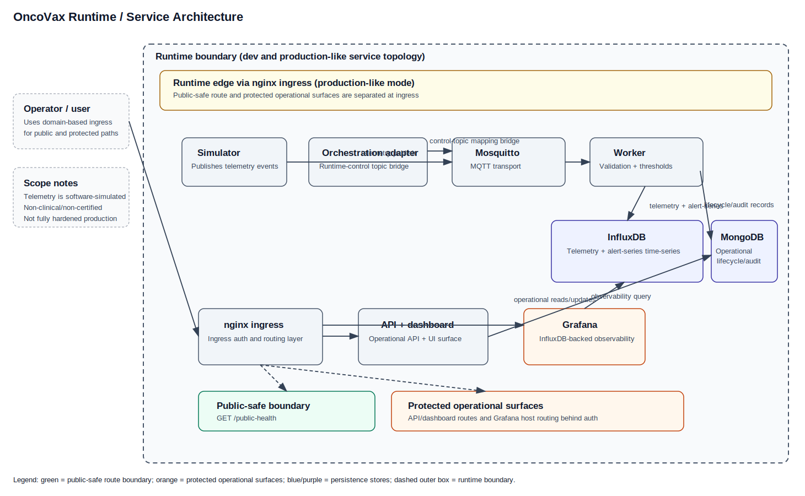

# OncoVax IoT Platform

OncoVax is an event-driven cold-storage monitoring platform baseline that demonstrates software-telemetry ingestion, threshold-based alerting, operational APIs, and observability in a hosted deployment context.

The repository implements a production-style architecture (MQTT transport, worker processing, time-series storage, operational persistence, API/dashboard delivery, and ingress controls) while keeping scope boundaries explicit: telemetry is software-simulated, this is not certified clinical infrastructure, and additional hardening is required before full release-grade production treatment.

## What this project is

- A concrete implementation of an event-driven monitoring stack:
  - simulator -> MQTT -> worker -> InfluxDB + MongoDB -> FastAPI/dashboard -> Grafana.
- A hosted-baseline deployment model with documented ingress boundaries and operational checks.
- A technical reference for operational behavior with conservative, evidence-based claims.

## What this project is not

- Not a physical medical-device fleet platform.
- Not a certified clinical or regulated deployment.
- Not an anonymous public operational dashboard deployment.
- Not a claim of fully complete production hardening.

## Architecture

The architecture is presented with **two diagrams** to separate runtime behavior from hosted deployment context.

### 1) Runtime / service architecture



This diagram explains how the system works internally: telemetry ingestion, worker processing, persistence responsibilities, API/dashboard access paths, and observability flow.

### 2) Hosted / infrastructure topology


This diagram explains hosted deployment context: live-domain ingress identity, DigitalOcean-style hosting substrate, VM/server boundary, external uptime-signal context, and Atlas-backed persistence compatibility boundary.

Companion interpretation and legend notes: [`docs/architecture-diagram.md`](docs/architecture-diagram.md)

## System components and responsibilities

- **Simulator (`services/simulator/`)**: publishes software-generated telemetry.
- **Orchestration adapter (`services/orchestration_adapter/`)**: bridges demo/runtime-control MQTT topics.
- **Mosquitto**: MQTT broker for telemetry and control-topic transport.
- **Worker (`services/worker/`)**: validates payloads, applies threshold logic, writes telemetry and alert lifecycle records.
- **InfluxDB**: time-series telemetry and alert-series store.
- **MongoDB**: operational lifecycle/audit persistence boundary used by API workflows.
- **FastAPI + dashboard (`services/api/` + `services/web/`)**: health and operational APIs plus dashboard experience.
- **Grafana (`grafana/`)**: InfluxDB-backed observability views.
- **nginx ingress (`infra/nginx/nginx.conf`)**: route/auth boundary in production-like topology.

## Hosted baseline and infrastructure roles

### Hosted VM / server role

The hosted baseline runs on a Linux cloud VM/server boundary. This VM is the runtime execution boundary for ingress, API/UI surfaces, worker pipeline components, and core service dependencies.

Operationally, this boundary matters because it is where route exposure policy, runtime health, restart behavior, and deployment configuration are enforced.

### DigitalOcean-style hosting role

DigitalOcean-style hosting is deployment substrate context for the implemented hosted baseline. It describes where the stack runs, not an application-layer capability and not a production-readiness guarantee.

### MongoDB Atlas compatibility role

The operational persistence contract is MongoDB-based and supports Atlas-backed operation through `MONGO_URI`.

This indicates managed persistence compatibility for the operational record boundary; it is not a claim of managed-service guarantees beyond repository scope.

### Live domain and ingress identity role

The live domain is the external ingress identity boundary for hosted access. In production-like topology (`infra/docker-compose.prod.yml` + `infra/nginx/nginx.conf`), nginx enforces route-level separation:

- public-safe `GET /public-health`
- protected operational API/dashboard paths
- protected Grafana host routing

### External uptime monitoring role

External uptime monitoring is availability-signal context for public endpoint reachability.

It does **not** prove:

- internal worker processing correctness
- persistence integrity correctness
- protected operational workflow correctness

## Deployment modes

- **Local/dev** (`infra/docker-compose.dev.yml`)
  - Includes simulator, orchestration adapter, Mosquitto, worker, API/UI, InfluxDB, MongoDB, Grafana, and Node-RED.
  - Intended for local development and end-to-end runtime validation.

- **Hosted baseline** (`infra/docker-compose.yml`)
  - Core hosted stack: Mosquitto, worker, API, InfluxDB, MongoDB.
  - Supports Atlas-backed persistence via `MONGO_URI`.

- **Production-like ingress** (`infra/docker-compose.prod.yml` + nginx)
  - Adds nginx ingress boundary, TLS mounting, protected routes, simulator, orchestration adapter, and Grafana.
  - Aligns with hosted topology validation and ingress policy checks.

See: [`docs/DEPLOYMENT.md`](docs/DEPLOYMENT.md)

## Security and operational boundaries

Current baseline controls include:

- ingress segmentation between public-safe and protected surfaces
- basic-auth protections for operational and Grafana ingress surfaces in production-like mode
- nginx rate limits on protected routes (including acknowledgement write paths)
- runbook and recovery/rollback procedures
- observability baseline through API checks, logs, InfluxDB, and Grafana where available

These are baseline controls, not complete production hardening.

## Local and hosted verification

Canonical local verification:

```bash
make verify-local
```

Production-like smoke verification (hosted environment required):

```bash
./scripts/smoke_test.sh --prod <domain> <username> <password>
```

## Documentation map

- Overview: [`docs/OVERVIEW.md`](docs/OVERVIEW.md)
- Architecture: [`docs/ARCHITECTURE.md`](docs/ARCHITECTURE.md)
- Architecture diagrams: [`docs/architecture-diagram.md`](docs/architecture-diagram.md)
- Data flow: [`docs/DATA_FLOW.md`](docs/DATA_FLOW.md)
- Deployment: [`docs/DEPLOYMENT.md`](docs/DEPLOYMENT.md)
- Observability: [`docs/OBSERVABILITY.md`](docs/OBSERVABILITY.md)
- Operations runbook: [`docs/RUNBOOK.md`](docs/RUNBOOK.md)
- Operator quick reference: [`OPS_RUNBOOK.md`](OPS_RUNBOOK.md)
- Recovery/rollback: [`docs/RECOVERY_AND_ROLLBACK.md`](docs/RECOVERY_AND_ROLLBACK.md)
- Security policy: [`SECURITY.md`](SECURITY.md)
- Threat model: [`docs/THREAT_MODEL.md`](docs/THREAT_MODEL.md)
- Known limitations: [`docs/KNOWN_LIMITATIONS.md`](docs/KNOWN_LIMITATIONS.md)
- Evidence map: [`docs/EVIDENCE_MAP.md`](docs/EVIDENCE_MAP.md)
- Final validation checklist: [`docs/FINAL_VALIDATION_CHECKLIST.md`](docs/FINAL_VALIDATION_CHECKLIST.md)
- Production hardening roadmap: [`docs/PRODUCTION_HARDENING_DAY1_DAY5.md`](docs/PRODUCTION_HARDENING_DAY1_DAY5.md)

## Non-claims

This repository does **not** claim:

- telemetry from physical medical-device fleets
- certified clinical or regulated deployment status
- complete production hardening or complete security assurance

Use this repository as a production-style engineering baseline with explicit operational boundaries and conservative claim discipline.
