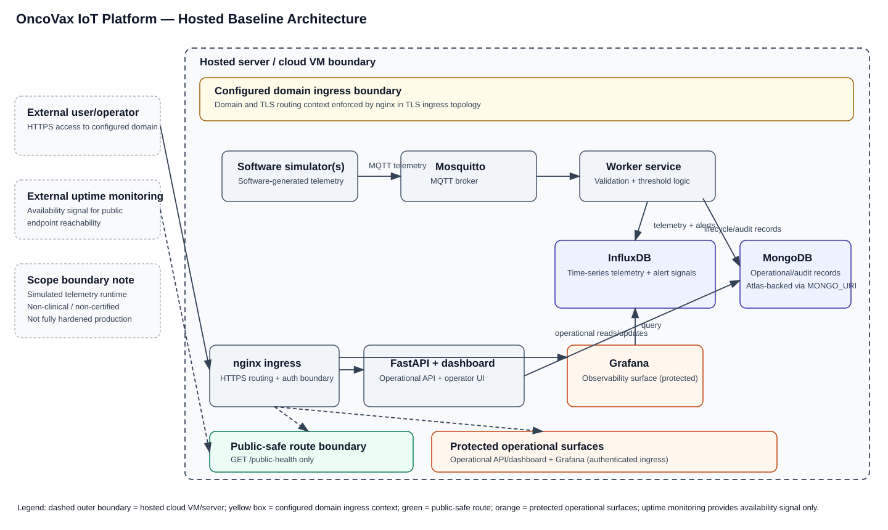
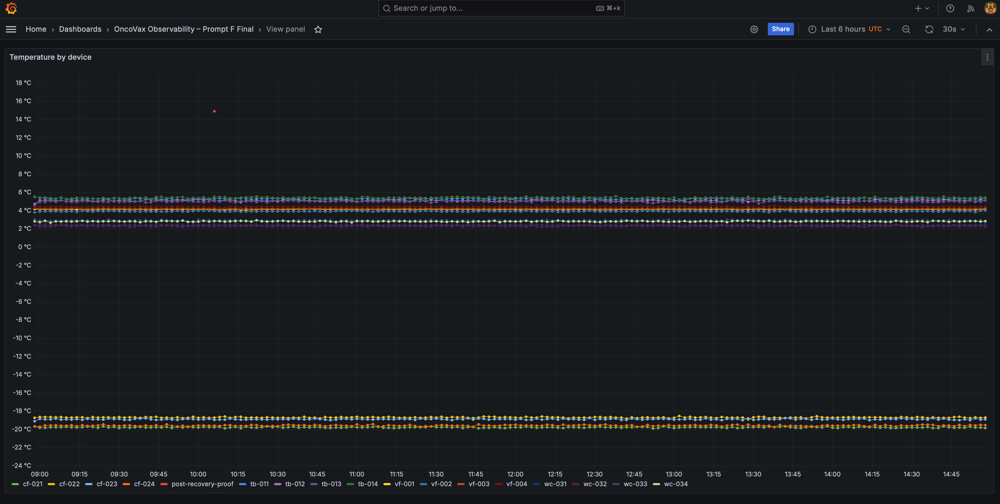

# OncoVax IoT Platform


OncoVax is an event-driven IoT monitoring platform for biotech cold-storage workflows. It ingests MQTT telemetry, detects temperature excursions, stores alert and acknowledgement records, and exposes FastAPI operator workflows and Grafana observability.

**Deployment status:** the DigitalOcean hosted deployment was previously validated and intentionally decommissioned for cost control after the available cloud credits were exhausted. The repository retains configuration, screenshots, checksums, runbooks, and recovery guidance. Historical domains and recordings are archived evidence, not active service entrypoints. See the [deployment archive](docs/DEPLOYMENT_ARCHIVE.md).

The included device fleet is software-simulated. This engineering baseline supports evaluation of monitoring workflows relevant to regulated biotech environments; it has no clinical certification or validated regulatory compliance. Application authentication/RBAC, durable alert deduplication, and recovery assurance remain [hardening work](docs/HARDENING_ROADMAP.md).

## Capabilities and architecture

```text
Simulator → Mosquitto MQTT → Worker → InfluxDB → Grafana
                                  → MongoDB → FastAPI + operator dashboard
```

- The worker normalizes and validates telemetry, evaluates temperature thresholds, and writes time-series and audit records.
- The API provides health, alert retrieval, summary, filtering, and acknowledgement with an operator name and optional incident note.
- MongoDB stores mutable alert lifecycle records; it is not an immutable compliance audit log. MongoDB Atlas is supported through `MONGO_URI`.
- Grafana shows device metrics, ingest activity, and alert signals.
- Docker Compose supplies local and self-hosted topologies. The nginx configuration supplies TLS and basic-auth ingress boundaries when provisioned on a host.
- An optional Node-RED interface and orchestration adapter control simulator scenarios over MQTT.



The [infrastructure diagram](docs/assets/oncovax-hosted-infrastructure-topology.svg) describes the archived hosting arrangement. [Architecture notes](docs/architecture-diagram.md) explain its boundaries.

## Run and verify locally

Prerequisites: Python 3.11+, Docker with Compose v2 supporting `up --wait`, and curl. Local Compose uses development credentials and publishes ports on loopback only.

```bash
python3 -m venv .venv
. .venv/bin/activate
python -m pip install -r requirements-dev.txt
make verify-static
make verify-local
```

`verify-static` runs pytest, Python/shell syntax checks, and Compose configuration checks without starting services. `verify-local` first runs those checks, builds and starts the stack, waits for readiness, then verifies API health, database reachability, and an end-to-end telemetry/alert/acknowledgement round trip. It leaves containers running for inspection. Use `make down` to stop them while retaining data volumes.

Local interfaces:

- [Operator dashboard](http://localhost:8000/)
- [API health](http://localhost:8000/health)
- [Grafana](http://localhost:3000/) — development login `admin` / `adminadminadmin`
- [Node-RED](http://localhost:1880/) — optional local control interface

Grafana's InfluxDB datasource and dashboard are provisioned by Compose. Existing persistent Grafana users retain their previous passwords.

## Deployment lifecycle

| Configuration | Purpose | Current status |
| --- | --- | --- |
| `infra/docker-compose.dev.yml` | Full local simulator, processing, API and observability stack | Runnable locally; verify on your machine |
| `infra/docker-compose.yml` | Core self-hosted services | Retained configuration; no active hosted service |
| `infra/docker-compose.prod.yml` | Self-hosted services with nginx TLS ingress | Requires credentials, certificates, DNS and host provisioning |

The `.prod.yml` filename is a compatibility convention, not a production-readiness claim. Only run remote smoke checks against a deployment you have provisioned and control; do not use the retired domain as a default test target. See [deployment instructions](docs/DEPLOYMENT.md).

## Archived deployment evidence



The [hosted walkthrough recording](https://youtu.be/Q5hKVtd-a3g) and [screenshot catalog](demo/screenshots/README.md) record earlier sessions. Screenshots and uptime captures support historical observations; they do not establish current availability or certify the complete system.

## Documentation

- [Architecture](docs/ARCHITECTURE.md), [data flow](docs/DATA_FLOW.md), and [overview](docs/OVERVIEW.md)
- [Deployment](docs/DEPLOYMENT.md) and [deployment archive](docs/DEPLOYMENT_ARCHIVE.md)
- [Operational runbook](docs/RUNBOOK.md), [quick reference](OPS_RUNBOOK.md), and [recovery](docs/RECOVERY_AND_ROLLBACK.md)
- [Observability](docs/OBSERVABILITY.md), [runtime walkthrough](docs/DEMO_WALKTHROUGH.md), and [scenarios](docs/DEMO_SCENARIOS.md)
- [Evidence map](docs/EVIDENCE_MAP.md) and [release validation checklist](docs/FINAL_VALIDATION_CHECKLIST.md)
- [Data contracts](schemas/README.md), [limitations](docs/KNOWN_LIMITATIONS.md), [security](SECURITY.md), and [threat model](docs/THREAT_MODEL.md)
- [Hardening roadmap](docs/HARDENING_ROADMAP.md) and [release notes](docs/RELEASE_NOTES_v0.2.0.md)

## License

OncoVax is source-available under the existing [LICENSE](LICENSE); see the [usage summary](LICENSE_POLICY.md). Existing contributor and AI-assistance attribution remains in Git history.
