# MVP Demo Scenarios

## Scenario 1: Cold-storage telemetry pipeline

This scenario demonstrates the baseline OncoVax MVP monitoring flow for a cold-storage asset.

A Python simulator publishes temperature telemetry for the asset type `coldstorage` to the MQTT topic `oncovax/telemetry`.
A Python worker subscribes to the topic, validates incoming messages against the telemetry schema, and writes valid records to InfluxDB.
Grafana then visualises the stored telemetry as a time-series dashboard.

The simulated data stream includes normal cold-storage temperature values around 4°C, with injected excursion spikes at 10.5°C.
These excursion spikes are visible in the Grafana dashboard and can also be verified in the InfluxDB Data Explorer.

## Stack used

- Mosquitto MQTT broker
- Python simulator
- Python worker
- InfluxDB
- Grafana

## What this MVP demonstrates

- structured telemetry publication through MQTT
- schema-aware processing in a dedicated Python worker
- time-series persistence in InfluxDB
- dashboard visualisation in Grafana
- visible abnormal temperature spikes for excursion-style scenarios

## Demo outputs

### Grafana panel query configuration

### Grafana dashboard view showing cold-storage telemetry

### InfluxDB raw telemetry record view

### InfluxDB filtered graph for temperature records

## MVP flow

simulator -> MQTT -> worker -> InfluxDB -> Grafana

## Current status

This scenario represents the implemented MVP telemetry baseline.
Planned next steps include richer excursion logic, audit-event storage, and role-based monitoring views.

---

## Scenario 2: Excursion alert detection and persistence

This scenario demonstrates the second MVP increment for the OncoVax monitoring platform.  
In this iteration, the worker no longer acts only as a validation and persistence component. It also applies a threshold-based excursion rule to incoming cold-storage telemetry.

When a temperature reading exceeds the configured threshold, the worker generates an alert event and writes that event into a dedicated `alerts` measurement in InfluxDB. This extends the platform from a monitoring-only pipeline into an event-aware monitoring workflow.

In the current implementation, the excursion rule is based on the `temperature` metric and a configurable threshold value. During validation, injected temperature spikes at `10.5°C` triggered alert creation, which was then confirmed in both InfluxDB and Grafana.

## What this increment adds

- threshold-based excursion detection in the Python worker
- alert event generation when cold-storage temperature exceeds the configured rule
- alert persistence in the `alerts` measurement in InfluxDB
- alert visibility in both InfluxDB Data Explorer and Grafana

## Sprint 2 outputs

### InfluxDB alerts graph

### InfluxDB alerts raw data

### Grafana excursion alert values

## Updated MVP flow

simulator -> MQTT -> worker -> InfluxDB -> Grafana + alert event generation

## Sprint 2 status

This increment confirms that the platform can not only ingest and visualise telemetry, but also detect threshold breaches and persist alert events for future audit-trail and acknowledgement workflows.

---

## Scenario 3: Audit trail baseline for excursion alerts

This scenario demonstrates the third MVP increment for the OncoVax monitoring platform.

In this iteration, the system extends beyond alert generation and introduces a basic audit-trail layer. When the worker detects an excursion alert, it not only writes the alert to InfluxDB, but also creates a structured audit document in MongoDB.

This provides the first baseline for future acknowledgement workflows, incident handling, and alert-history tracking.

## What this increment adds

- MongoDB added to the development stack
- audit record creation for excursion alerts
- structured audit fields including alert ID, status, threshold, device context, and acknowledgement placeholders
- persistence of operational alert history outside the telemetry time-series path

## Sprint 3 outputs

### Worker log showing alert and audit write

### MongoDB audit record

### Docker stack including MongoDB

## Updated MVP flow

simulator -> MQTT -> worker -> InfluxDB + MongoDB -> Grafana

## Sprint 3 status

This increment confirms that the platform can detect excursions, persist alerts to InfluxDB, and create audit-trail records in MongoDB as a baseline for future acknowledgement and incident workflows.

---

## Scenario 4: Manual acknowledgement workflow baseline

This scenario demonstrates the fourth MVP increment for the OncoVax monitoring platform.

In this iteration, the system introduces a manual acknowledgement workflow for audit-trail records stored in MongoDB. A Python utility script can now locate a specific alert by its `alert_id` and update the audit record with acknowledgement metadata.

This extends the prototype from alert creation and audit persistence into a basic operational workflow where an alert can be explicitly acknowledged by an operator.

## What this increment adds

- manual acknowledgement of audit records
- update of `acknowledged` state in MongoDB
- support for `acknowledged_by`, `acknowledged_at`, and `incident_note`
- baseline operator action workflow for future API or UI-based acknowledgement features

## Sprint 4 outputs

### Acknowledge script success output
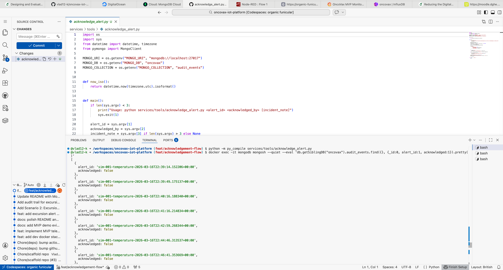

### MongoDB audit record after acknowledgement
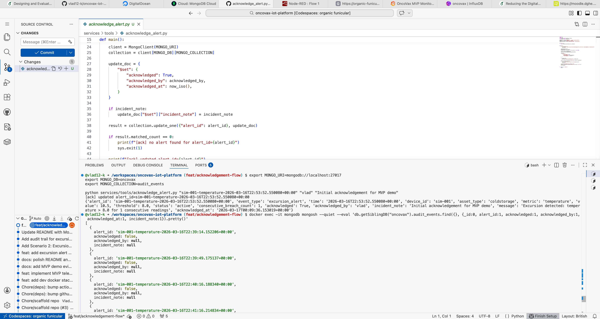

## Updated MVP flow

simulator -> MQTT -> worker -> InfluxDB + MongoDB -> Grafana -> acknowledgement update

## Sprint 4 status

This increment confirms that the platform can not only detect and store excursion alerts, but also support a basic acknowledgement workflow for recorded operational events.

---

## Scenario 5: Operational readiness and repository polish

This scenario demonstrates the fifth MVP increment for the OncoVax monitoring platform.

In this iteration, the focus shifts from core feature delivery to operational clarity and repository usability. The repository was updated with a clearer `README.md`, an improved Quickstart section, and a smoke test script for validating that the main platform services are running and reachable.

This increment improves the practical readiness of the prototype by making the stack easier to understand, launch, and verify during development and demonstration.

## What this increment adds

- improved repository documentation in `README.md`
- Quickstart instructions for launching the development stack
- smoke test script for validating service readiness
- clearer platform presentation for demo, review, and portfolio use

## Sprint 5 outputs

### Smoke test script
`scripts/smoke_test.sh`

### Repository quickstart and documentation update
`README.md`

## Updated MVP flow

simulator -> MQTT -> worker -> InfluxDB + MongoDB -> Grafana -> acknowledgement update

## Sprint 5 status

This increment confirms that the platform is not only feature-complete at the MVP level, but also easier to run, validate, and present in a structured development workflow.

---

## Scenario 6: Node-RED flow baseline

This scenario demonstrates the sixth MVP increment for the OncoVax monitoring platform.

In this iteration, Node-RED is used as a live flow-processing layer connected to the MQTT telemetry topic. The flow subscribes to incoming telemetry, parses JSON payloads, displays all messages in the debug panel, and routes high-temperature readings through a threshold-based switch node.

This confirms that Node-RED is not only present in the development stack, but also actively connected to the telemetry pipeline as a prototyping and routing layer.

## What this increment adds

- active Node-RED participation in the telemetry flow
- MQTT subscription to the `oncovax/telemetry` topic
- JSON parsing inside Node-RED
- threshold-based routing of excursion-style messages
- debug visibility for live telemetry and high-temperature events

## Sprint 6 outputs

### Node-RED flow canvas
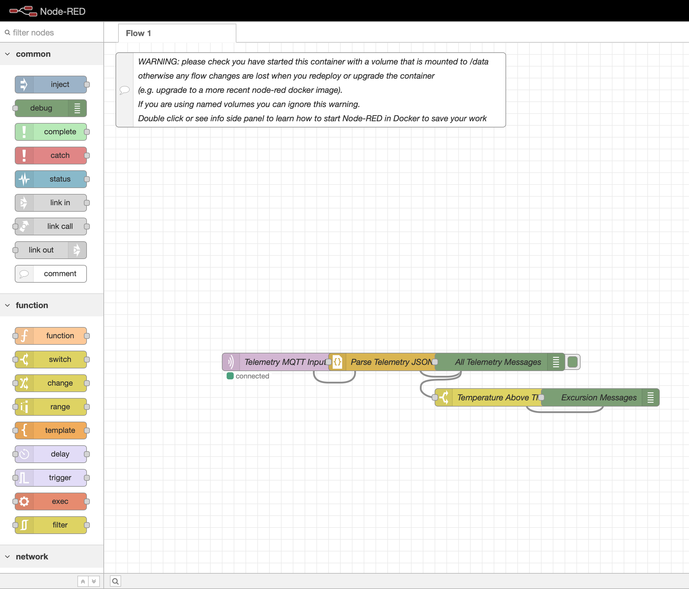

### Node-RED debug panel with telemetry messages
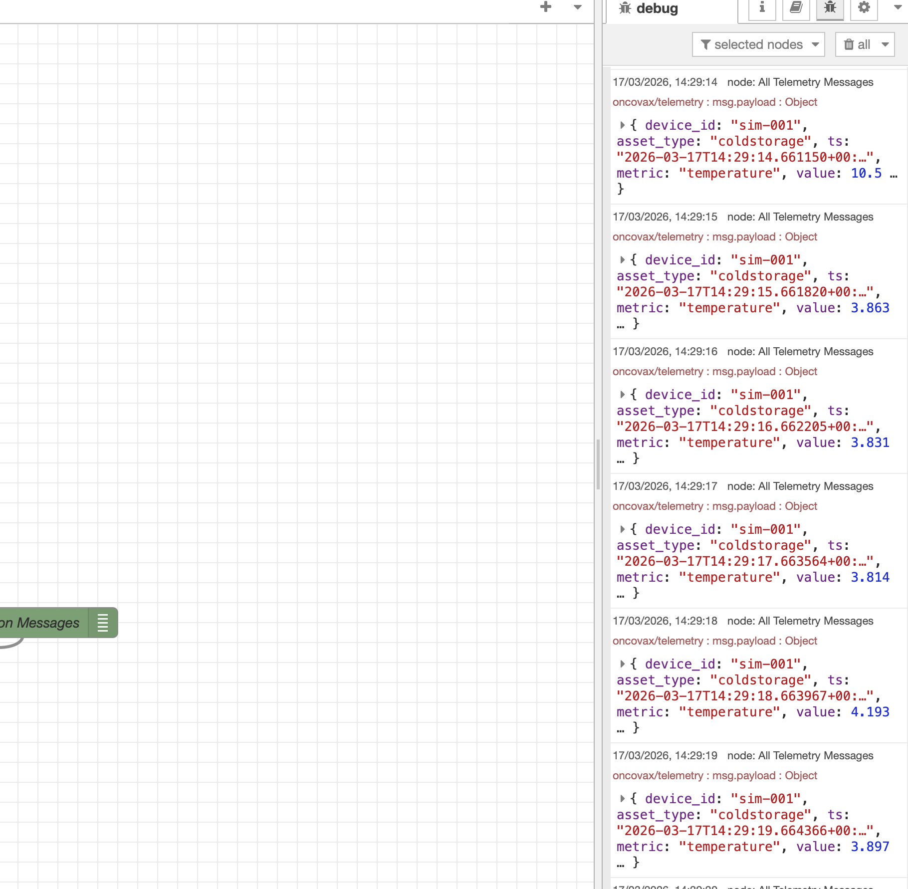

## Updated MVP flow

simulator -> MQTT -> worker -> InfluxDB + MongoDB -> Grafana  
simulator -> MQTT -> Node-RED flow

## Sprint 6 status

This increment confirms that Node-RED is operational within the platform and can be used as a practical routing and prototyping layer for live telemetry handling.

---

## Scenario 7: API baseline for alert retrieval and acknowledgement

This scenario demonstrates the seventh MVP increment for the OncoVax monitoring platform.

In this iteration, a lightweight FastAPI service is introduced as a service layer over the MongoDB audit store. The API provides basic operational endpoints for checking service health, retrieving stored alert records, and acknowledging alerts through an HTTP request.

This extends the platform beyond script-based operations and establishes a clearer foundation for future UI, workflow automation, or role-based integration.

## What this increment adds

- FastAPI service for alert operations
- `GET /health` endpoint for service readiness checks
- `GET /alerts` endpoint for retrieving stored alert records
- `POST /alerts/{alert_id}/acknowledge` endpoint for updating acknowledgement state through HTTP
- service-layer baseline for future application integration

## Sprint 7 outputs

### API alert retrieval
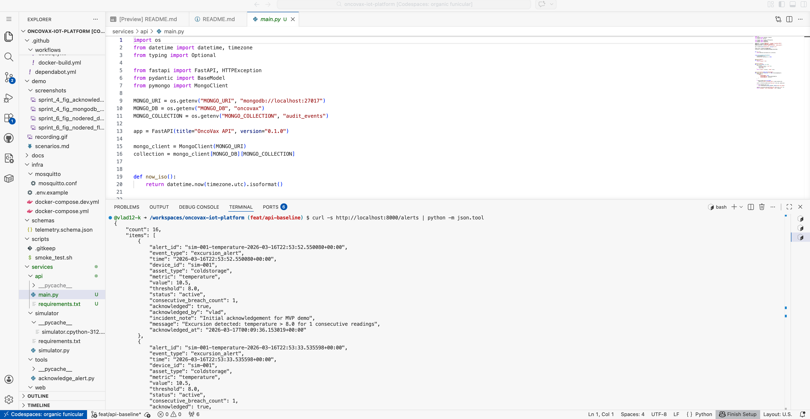

### API acknowledge POST request
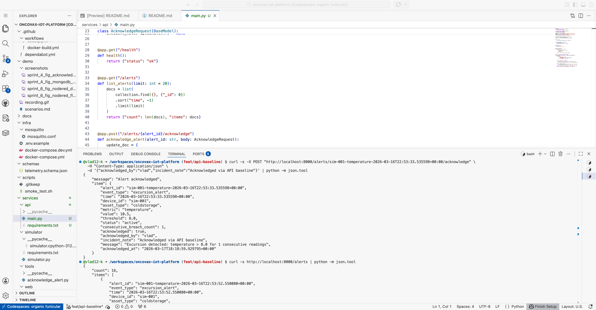

### Alerts after API acknowledgement
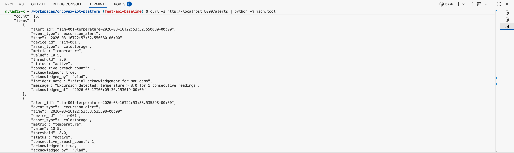

## Updated MVP flow

simulator -> MQTT -> worker -> InfluxDB + MongoDB -> Grafana  
manual or API acknowledgement -> MongoDB audit record update

## Sprint 7 status

This increment confirms that the platform now includes a lightweight API layer for operational alert retrieval and acknowledgement, providing a stronger foundation for future interfaces and workflow extensions.

---

## Scenario 8: Containerized API deployment baseline

This scenario demonstrates the eighth MVP increment for the OncoVax monitoring platform.

In this iteration, the FastAPI alert service is moved from a manually started local process into the Docker Compose development stack. A dedicated API container is now built and started alongside the existing platform services, allowing the API to behave as part of the platform runtime rather than as a separate ad hoc process.

The smoke test was also extended to validate API health as part of the overall platform readiness check.

## What this increment adds

- Dockerfile for the FastAPI service
- API service integrated into `docker-compose.dev.yml`
- containerized API runtime on port `8000`
- smoke test validation for API health
- more production-like service orchestration for the development stack

## Sprint 8 outputs

### Docker stack with API container
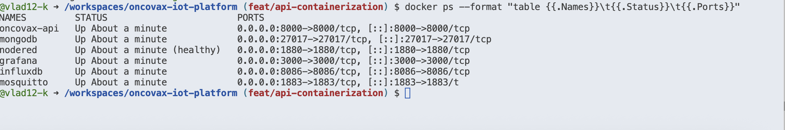

### Containerized API health
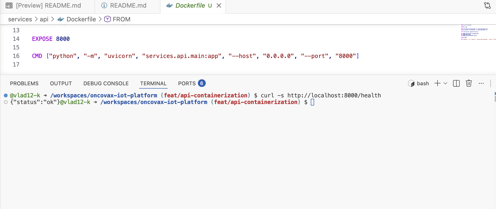

### Smoke test with API check
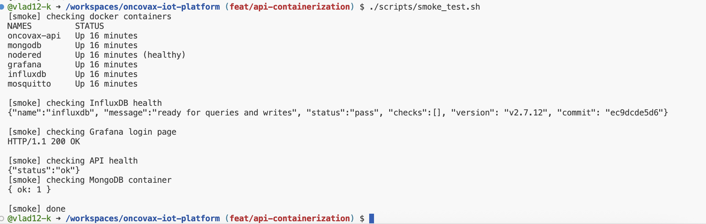

## Updated MVP flow

simulator -> MQTT -> worker -> InfluxDB + MongoDB -> Grafana  
containerized API service -> MongoDB audit access and acknowledgement support

## Sprint 8 status

This increment confirms that the API is now part of the containerized platform stack and can be validated through the same operational readiness workflow as the rest of the development environment.

---

## Scenario 9: Deployment readiness baseline

This scenario demonstrates the ninth MVP increment for the OncoVax monitoring platform.

In this iteration, the platform is prepared for a more deployment-ready configuration. A shared `.env.example` file is introduced to document core runtime settings, and the containerized API service is extended with a Docker healthcheck so that service readiness can be verified automatically as part of the stack lifecycle.

This increment improves the operational maturity of the platform and provides a cleaner baseline for future hosted deployment work.

## What this increment adds

- `.env.example` for core platform configuration
- API container healthcheck in Docker Compose
- clearer readiness verification for the API service
- stronger foundation for future deployment and hosting steps

## Sprint 9 outputs

### Environment example configuration
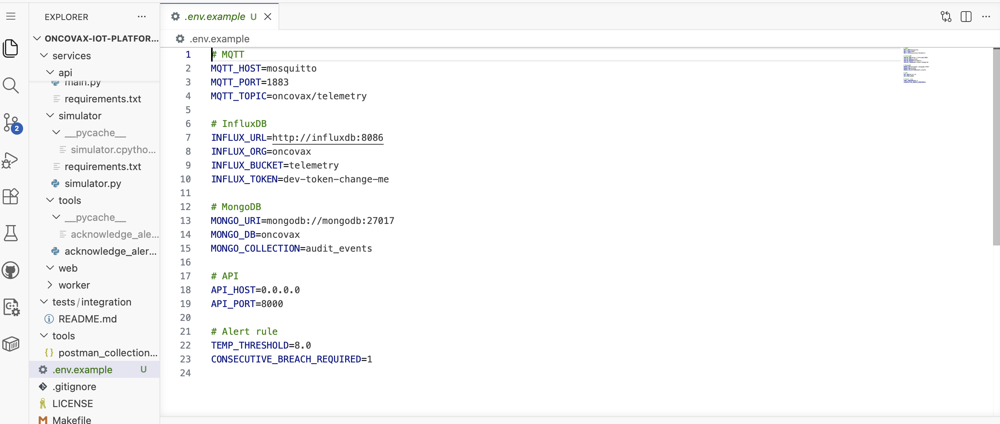

### Docker Compose API service with healthcheck configuration
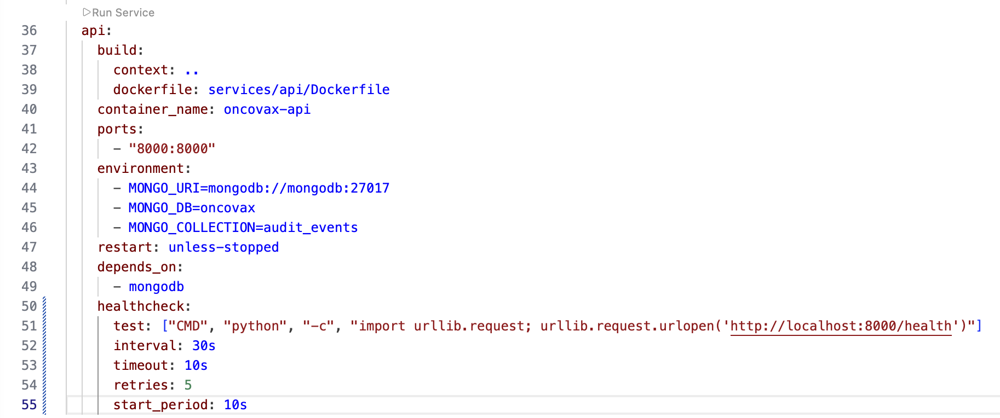

### Running platform stack with containerized API in healthy state
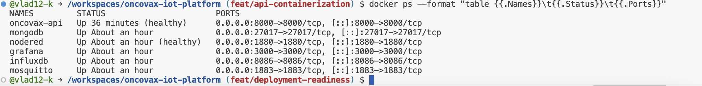

## Updated MVP flow

simulator -> MQTT -> worker -> InfluxDB + MongoDB -> Grafana  
containerized API service with healthcheck -> MongoDB audit access and acknowledgement support

## Sprint 9 status

This increment confirms that the platform now includes a cleaner deployment-readiness baseline with documented environment configuration and automated API readiness checks.

---

## Scenario 10: API service maturity baseline

This scenario demonstrates the tenth MVP increment for the OncoVax monitoring platform.

In this iteration, the API layer is extended beyond the initial alert retrieval and acknowledgement baseline. The FastAPI service now supports retrieval of a single alert by `alert_id`, filtered retrieval of alerts by acknowledgement state, and a summary endpoint for aggregate alert counts.

This improves the practical usefulness of the service layer and provides a stronger foundation for future UI and operational workflow features.

## What this increment adds

- `GET /alerts/{alert_id}` for single alert retrieval
- `GET /alerts?acknowledged=true|false` for filtered alert retrieval
- `GET /summary` for aggregate alert counts
- stronger operational API layer for future interface and service expansion

## Sprint 10 outputs

### API single alert retrieval by alert_id
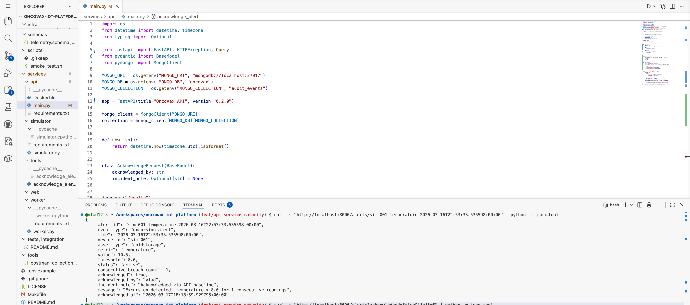

### API filtered retrieval of unacknowledged alerts
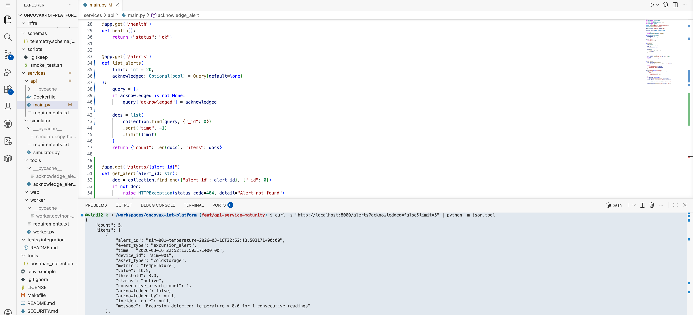

### API alert summary endpoint
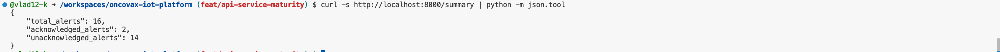

## Updated MVP flow

simulator -> MQTT -> worker -> InfluxDB + MongoDB -> Grafana  
containerized API service -> alert retrieval, filtering, summary, and acknowledgement support

## Sprint 10 status

This increment confirms that the API has moved beyond a minimal baseline and now provides a more practical operational service layer for alert handling and future interface development.

---

## Scenario 11: Lightweight operational UI baseline

This scenario demonstrates the eleventh MVP increment for the OncoVax monitoring platform.

In this iteration, a lightweight operational dashboard is introduced as a presentation layer over the existing API service. The dashboard is served through the FastAPI container itself, allowing the interface and API to operate from the same origin and avoiding cross-origin access issues in the Codespaces environment.

The page presents alert summary cards, a live alert register, filtering by acknowledgement state, and client-side search over alert records.

## What this increment adds

- lightweight operational dashboard served by FastAPI
- same-origin UI and API setup
- summary cards for total, acknowledged, and unacknowledged alerts
- alert table for operational review
- filter control for acknowledgement state
- search interaction for alert record inspection

## Sprint 11 outputs

### Operational dashboard main view
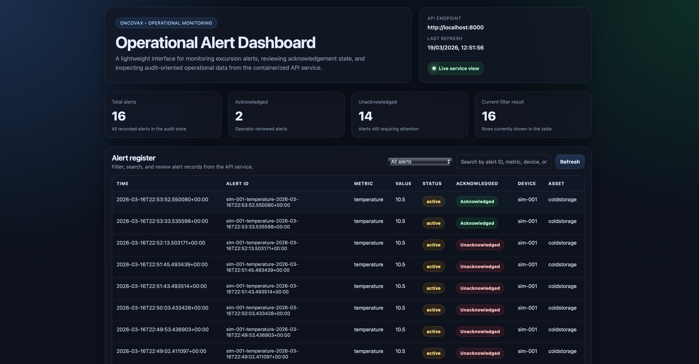

### Operational dashboard filtered view
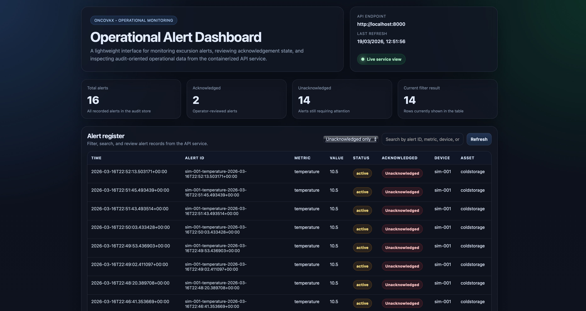

### Operational dashboard search view
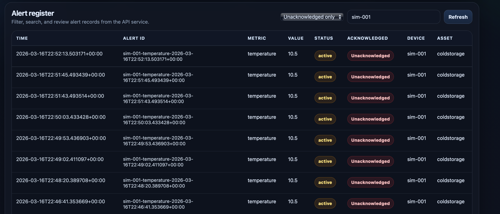

## Updated MVP flow

simulator -> MQTT -> worker -> InfluxDB + MongoDB -> Grafana  
containerized FastAPI service -> same-origin operational dashboard + alert API

## Sprint 11 status

This increment confirms that the platform now includes a lightweight operational interface for reviewing alert state and summary information, creating a stronger foundation for future hosted deployment and user-facing workflow features.
