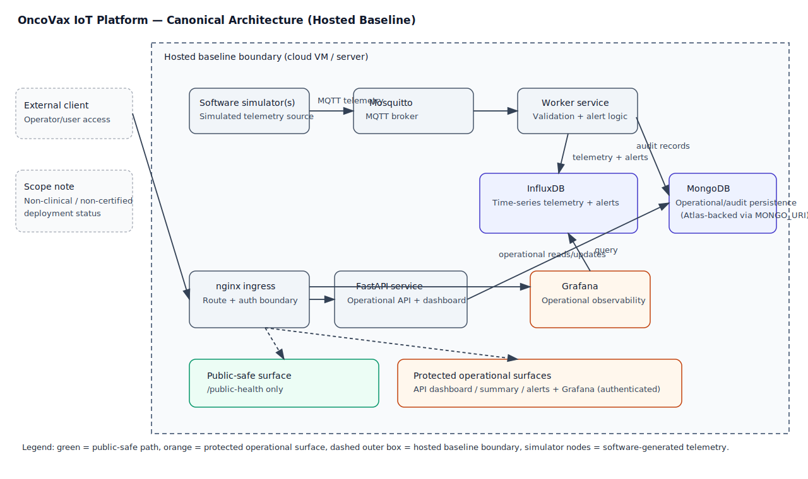
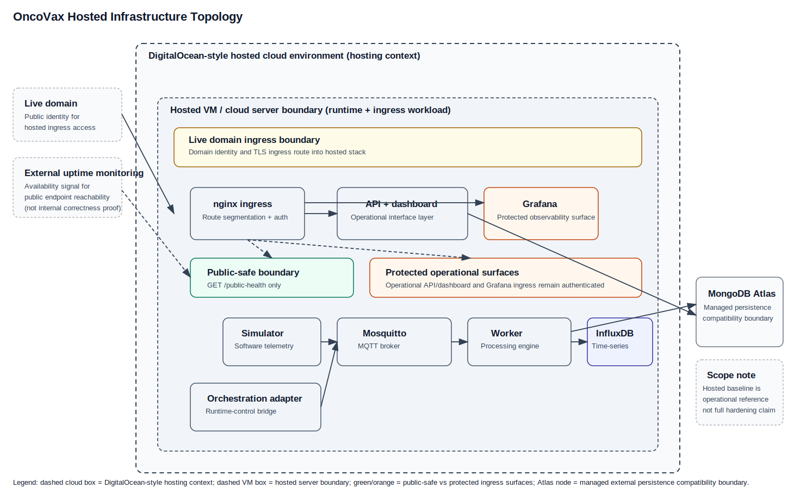

# OncoVax Architecture Diagrams

## Why there are two diagrams

The project now uses two canonical architecture diagrams to separate concerns that were previously mixed:

1. **Runtime / service architecture** (internal system behavior)
2. **Hosted / infrastructure topology** (deployment context and external boundaries)

This split improves clarity and keeps runtime behavior distinct from hosting context.

## Diagram 1: Runtime / service architecture

Purpose:

- shows how services interact internally
- shows telemetry flow, operational/API flow, and observability flow
- shows ingress-facing route separation between public-safe and protected operational surfaces

Interpretation notes:

- Runtime flow is centered on `simulator/orchestration-adapter -> Mosquitto -> worker -> InfluxDB + MongoDB`.
- API/dashboard and Grafana are operator-facing surfaces behind ingress controls in production-like topology.
- Public-safe ingress exposure is narrow (`GET /public-health`), while operational surfaces remain protected.

## Diagram 2: Hosted / infrastructure topology

Purpose:

- shows where the runtime stack is hosted
- shows live-domain ingress identity and uptime-check context
- shows managed persistence compatibility boundary (MongoDB Atlas) relative to hosted runtime

Interpretation notes:

- DigitalOcean-style hosting is deployment substrate context, not an application service claim.
- Hosted VM/server boundary contains ingress and runtime workload services.
- MongoDB Atlas is represented as managed persistence compatibility/external boundary, not as proof of production guarantees.
- External uptime monitoring is an availability signal for public endpoint reachability, not proof of full internal correctness.

## Rendering notes

Both diagrams are embedded as direct SVG assets with GitHub-safe relative paths from this document:

- `./assets/oncovax-architecture-diagram.svg`
- `./assets/oncovax-hosted-infrastructure-topology.svg`

## Scope and non-claims

These diagrams do **not** claim:

- telemetry from physical medical devices in repository runtime
- certified clinical or regulated deployment status
- complete production hardening

## Related references

- `README.md`
- `docs/ARCHITECTURE.md`
- `docs/DATA_FLOW.md`
- `docs/DEPLOYMENT.md`
- `docs/OBSERVABILITY.md`
- `SECURITY.md`
- `docs/KNOWN_LIMITATIONS.md`
- `docs/EVIDENCE_MAP.md`
